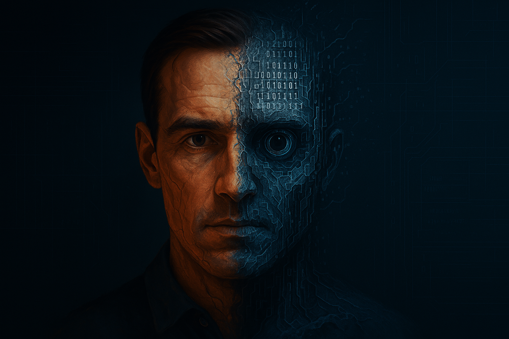

# Mirror Reality

<div align="center">
    
    
[](https://twitter.com/MirrorReality9)
[](https://github.com/Mirror-Reality/mirror-reality)
[](https://mirror-reality.xyz)

[English](./README.md) | [简体中文](./README_zh.md)

---

**Mirror Reality: Digital Identity Platform on Solana**

Create your digital world avatar, bridging reality and virtuality.

</div>

## Project Overview

Mirror Reality is a digital identity management platform based on Solana blockchain and artificial intelligence technology. It enables users to create and manage their digital mirrors, which can represent users in digital world interactions and decision-making.

## Core Features

- 🧠 **Personalized AI Models**: Personalized AI models trained on user behavior and preferences
- 🔐 **Blockchain Identity Verification**: Using Solana blockchain for identity security and ownership
- 🌐 **Multi-platform Integration**: Cross-platform identity expression and interaction
- 📊 **User Feedback System**: Continuous learning and optimization feedback mechanism
- 💾 **Digital Legacy Management**: Secure digital identity inheritance and transfer mechanism

## Tech Stack

### Backend
- **Framework**: FastAPI
- **Database**: PostgreSQL
- **AI/ML**: PyTorch, Transformers
- **Blockchain**: Solana
- **Storage**: IPFS

### Frontend
- **Framework**: React.js
- **State Management**: React Context
- **UI Components**: Styled Components
- **Blockchain Interaction**: @solana/web3.js
- **Wallet Integration**: @solana/wallet-adapter

### Smart Contracts
- **Language**: Rust
- **Framework**: Anchor
- **Testing**: Mocha, Chai

## Quick Start

### Requirements

- Node.js >= 14.0.0
- Python >= 3.8
- Rust >= 1.56.0
- Solana CLI >= 1.9.0
- PostgreSQL >= 12.0

### Installation Steps

1. Clone Repository
```bash
git clone https://github.com/Mirror-Reality/mirror-reality.git
cd mirror-reality
```

2. Install Backend Dependencies
```bash
cd backend
python -m venv venv
source venv/bin/activate  # Linux/Mac
# or
.\venv\Scripts\activate  # Windows
pip install -r requirements.txt
```

3. Install Frontend Dependencies
```bash
cd frontend
npm install
```

4. Install Smart Contract Dependencies
```bash
cd smart_contracts
npm install
```

5. Configure Environment Variables
```bash
cp config/.env.example config/.env
# Edit .env file with necessary configurations
```

### Running Development Environment

1. Start Backend Service
```bash
cd backend
uvicorn main:app --reload
```

2. Start Frontend Development Server
```bash
cd frontend
npm start
```

3. Deploy Smart Contracts
```bash
cd smart_contracts
anchor build
anchor deploy
```

## Project Structure

```
mirror_reality/
├── backend/           # Backend services
├── frontend/          # Frontend application
├── smart_contracts/   # Solana smart contracts
├── docs/             # Documentation
├── scripts/          # Utility scripts
└── config/           # Configuration files
```

## Technical Innovation

### 1. AI Technology Innovation
- **Multi-modal Deep Learning**: Combining visual, audio, and text for natural human-machine interaction
- **Federated Learning**: Distributed model training for privacy protection
- **Knowledge Graph**: Building personalized knowledge graphs to enhance cognitive abilities
- **Emotional Calculation**: Integrating emotional recognition for humanized interaction

### 2. Blockchain Technology Innovation
- **Zero-knowledge Proof**: zk-SNARK technology for privacy protection
- **Smart Contract Optimization**: Innovative contract architecture to reduce Gas fees
- **Cross-chain Interoperability**: Multi-chain support to expand applications
- **Decentralized Storage**: Hybrid storage solution combining IPFS and Arweave

### 3. Security Innovation
- **Homomorphic Encryption**: Data processing in encrypted state
- **Multi-signature**: Innovative multi-signature scheme for digital asset protection
- **Biometric Authentication**: Integrating latest biometric recognition
- **Privacy Calculation**: Multi-party secure calculation

## Development Roadmap

### 2024 Q4
- [x] Project Launch
- [x] Core Team Formation
- [x] Infrastructure Design
- [ ] MVP Development

### 2025 Q1
- [ ] AI Model Training Framework
- [ ] Blockchain Infrastructure
- [ ] User Interface Prototype
- [ ] Security Architecture Implementation

### 2025 Q2
- [ ] Test Version Release
- [ ] Community Building
- [ ] Developer Documentation
- [ ] Performance Optimization

### 2025 Q3-Q4
- [ ] Official Release
- [ ] Business Partner Expansion
- [ ] Global Market Development
- [ ] Ecosystem Construction

## Business Applications

### 1. Enterprise Applications
- **Digital Transformation**
  - Intelligent Customer Service
  - Employee Training Assistant
  - Knowledge Management
  - Decision Support System

- **Data Asset Management**
  - Data Rights
  - Data Transaction
  - Data Tracking
  - Data Monetization

### 2. Personal Applications
- **Personal Growth**
  - Learning Assistant
  - Life Planning
  - Health Management
  - Financial Consulting

- **Digital Legacy**
  - Memory Inheritance
  - Value Transfer
  - Intelligent Agent
  - Permanent Storage

### 3. Industry Solutions
- **Financial Industry**
  - Intelligent Investment Consulting
  - Risk Control
  - Asset Management
  - Compliance Review

- **Medical**
  - Personal Health Record
  - Remote Diagnosis Assistant
  - Medical Research Support
  - Health Alert System

- **Education and Training**
  - Personalized Learning
  - Ability Assessment
  - Course Recommendation
  - Learning Tracking

- **Culture and Creativity**
  - Digital Art Creation
  - Copyright Protection
  - Content Distribution
  - Fan Interaction

### 4. Business Model
- **Subscription Service**
  - Basic: Personal Basic Function
  - Professional: Enhanced Features and Priority Support
  - Enterprise: Customized Solution

- **Transaction Income**
  - Data Transaction
  - Smart Contract Execution
  - NFT Transaction
  - Service Market

- **Technology License**
  - API Service
  - SDK Development Tool
  - Solution License
  - Patent Technology Transfer

### 5. Revenue Stream
- Subscription Fee
- Transaction Fee
- Technology Service Fee
- Advertising Income
- Data Value-added Service

### 6. Market Strategy
- **User Acquisition**
  - Community Operation
  - Content Marketing
  - Channel Partner Relationship
  - User Incentive

- **Brand Building**
  - Technical Leadership
  - Industry Influence
  - User Reputation
  - Social Responsibility

- **Ecosystem Development**
  - Developer Community
  - Industry Alliance
  - Academic Cooperation
  - Innovation Incubation

## Contact Us

- Official Website: [www.mirror-reality.xyz](http://www.mirror-reality.xyz)
- Email: contact@mirror-reality.xyz
- Twitter: [@MirrorReality9](https://twitter.com/MirrorReality9)
- GitHub: [Mirror-Reality/mirror-reality](https://github.com/Mirror-Reality/mirror-reality)

## License

This project is licensed under the MIT License - see [LICENSE](LICENSE) file for details. 