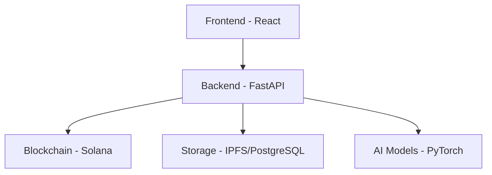

# Mirror Reality Architecture

## 1. System Overview

Mirror Reality is a decentralized digital identity platform built on Solana blockchain. The system enables users to create, train, and manage their digital mirrors using AI technology.

### 1.1 Core Components

## 2. Component Details

### 2.1 Frontend (React)
- Single Page Application (SPA)
- TypeScript for type safety
- Material-UI for components
- Redux for state management
- Web3.js for blockchain interaction
- WebSocket for real-time updates

### 2.2 Backend (FastAPI)
- Asynchronous Python framework
- RESTful API design
- WebSocket support
- JWT authentication
- Rate limiting
- Request validation

### 2.3 Blockchain (Solana)
- Smart contracts in Rust
- Mirror NFT management
- Transaction processing
- Access control
- Data verification

### 2.4 Storage
- IPFS for decentralized storage
- PostgreSQL for structured data
- Redis for caching
- Data encryption
- Backup strategies

### 2.5 AI Models
- PyTorch framework
- Model training pipeline
- Inference optimization
- Model versioning
- Performance monitoring

## 3. Data Flow

### 3.1 User Interaction
1. User authentication
2. Mirror creation request
3. Data processing
4. Model training
5. Mirror deployment

### 3.2 Mirror Creation
1. Data collection
2. Preprocessing
3. Model training
4. Validation
5. Deployment

### 3.3 Data Synchronization
1. Real-time updates
2. Blockchain verification
3. Storage management
4. Cache invalidation

## 4. Security Architecture

### 4.1 Authentication
- JWT tokens
- Wallet signatures
- Session management
- 2FA support

### 4.2 Data Security
- End-to-end encryption
- Data anonymization
- Access control
- Audit logging

### 4.3 Network Security
- HTTPS/WSS
- Rate limiting
- DDoS protection
- IP filtering

## 5. Scalability Design

### 5.1 Horizontal Scaling
- Load balancing
- Service replication
- Database sharding
- Cache distribution

### 5.2 Vertical Scaling
- Resource optimization
- Performance tuning
- Hardware upgrades
- Capacity planning

## 6. Monitoring and Operations

### 6.1 System Monitoring
- Prometheus metrics
- Grafana dashboards
- Alert management
- Log aggregation

### 6.2 Performance Tracking
- Response times
- Resource usage
- Error rates
- User metrics

### 6.3 Disaster Recovery
- Backup systems
- Failover procedures
- Data recovery
- Business continuity

## 7. Development Environment

### 7.1 Local Setup
- Docker containers
- Development tools
- Test environment
- Debug utilities

### 7.2 CI/CD Pipeline
- Automated testing
- Code quality checks
- Deployment automation
- Version control

## 8. Future Planning

### 8.1 Short-term Goals
- Performance optimization
- Feature enhancement
- Security improvements
- User experience updates

### 8.2 Long-term Vision
- Platform expansion
- Protocol upgrades
- Community growth
- Technology innovation 